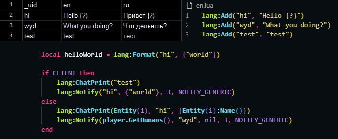

# 🌍 CSV2Lang Converter

This is a simple CSV to Lua converter for this [awesome localization library](https://github.com/Be1zebub/Small-GLua-Things/blob/master/libs/lang.lua).

The main thing here - it's a super quick way to add translations to your Garry's Mod addons.  
No more manual translation work - just throw everything into Google Sheets, export to CSV, convert it, and boom - you've got your Lua files!



## 🚀 How to Use

1. Grab the latest `csv2lang.exe` from the [releases page](https://github.com/Be1zebub/csv2lang/releases)
2. Make a translation file in google sheets & export it to CSV
3. Drop your CSV file onto the `csv2lang.exe` you just downloaded
4. Done! You'll find a `result_{filename}` folder next to your CSV with all the Lua goodies

## 📝 CSV File Requirements

Nothing fancy here:

- Need a `_uid` column for unique IDs
- At least one language column
- No empty cells (all translations must be filled)

Here's what your CSV should look like:

```csv
_uid,en,ru
HELLO,"Hello world","Привет мир"
GOODBYE,"Goodbye","До свидания"
```

🔥 **Pro tip:** Use Google Sheets for easy translation management on any device with web browser. [Check out this example](https://docs.google.com/spreadsheets/d/116h6fBrIeBlMfUOVRkacwtrYKDhN-D8oBUROAhks7HE/)

## 💻 For Developers

### What you'll need

- Node.js 16+ (older versions not tested)
- npm (comes with Node.js)

### Setup

```bash
npm install  # gets all the needed packages
```

### Build

```bash
npm run build  # creates the exe in the dist folder
```

## 🤔 FAQ

**Q:** Why CSV?  
**A:** CSV is simple and universal. Every spreadsheet app out there (Excel, Google Sheets, LibreOffice) can handle it.

**Q:** How do I export from Google Sheets?  
**A:** File -> Download -> Comma Separated Values (.csv)

**Q:** Getting errors?  
**A:** Check these things:

1. Your CSV has the `_uid` column
2. All translations are filled in
3. File is saved in UTF-8 encoding

## 🤝 Contributing

Found a bug? Got an idea for improvement? Create an issue or send a pull request!

## 📜 License

ISC - do whatever you want, just remember to credit the author 😉
